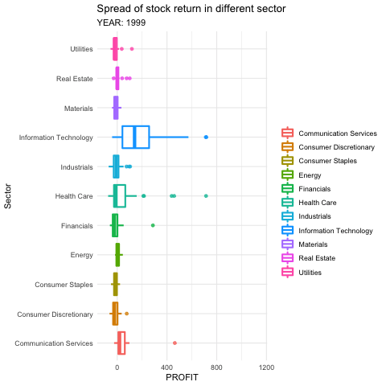

```{r}
knitr::opts_chunk$set(echo = TRUE, message=FALSE, warning=FALSE)
```

```{r}
library(tidyverse)         # for reading in data, graphing, and cleaning
library(tidymodels)        # for modeling ... tidily
library(usemodels)         # for suggesting step_XXX() functions
library(glmnet)            # for regularized regression, including LASSO
library(naniar)            # for examining missing values (NAs)
library(lubridate)         # for date manipulation
library(moderndive)        # for King County housing data
library(vip)               # for variable importance plots
library(rmarkdown)         # for paged tables
library(readr)
library(fastDummies)
library(kableExtra)
theme_set(theme_minimal()) # my favorite ggplot2 theme :)
library(gganimate)
```


```{r}
finalDATASET <- read_csv("FINALDATASET.csv")
macro_data <- read_csv("clean_macro - Sheet1.csv")
```

```{r}
final_data <- finalDATASET %>% 
  # make Sector dummy variables
  dummy_cols(select_columns = "Sector") %>% 
  # merge with updated macro data
  select(-CPALTT01USM657N_PC1,
         -GDP,
         -GDP_PC1,
         -M1SL_PC1 ,
         -M1SL) %>% 
  merge(macro_data) %>% 
  # convert Macro factors from characters to numeric
  mutate(across(c("CPALTT01USM657N_PC1","GDP","GDP_PC1","T10Y2Y","M1SL_PC1","M1SL"),
                as.numeric)) %>% 
  group_by(YEAR,Sector) %>% 
  # replacing the missing value with median od the industry in that year
  mutate(across(c(DEBTS,INVESTMENTS,CASH,VOLUME,EARNINGS,COGS,SALES,RECEIVABLE,INVENTORY),~replace(.,.==0,mean(.)))) %>%
  # delete less important factors -> Exchange can possibily be deleted
  ungroup() %>%  
  mutate(across(c(!where(is.numeric),-"COMPANY",-"Name"),as.factor)) %>% 
  select(-Earnings_next_year,-observation_date) %>% 
  drop_na()
```

```{r}
final_data %>% 
  select(where(is.numeric)) %>% 
  summary() %>% 
  kbl() %>% 
  scroll_box(width = "100%", height = "300px")

final_data %>% 
  select(!where(is.numeric)) %>% 
  summary() %>% 
  kbl()
```

We first explored distributions of our predictors and outcome. As the following graph suggested, all the numeric variables are severely right-skewed with some outliers. In our data, though the numbers of firms in each sector are unbalanced, we got a decent amount of data for each sector.  
```{r}

  final_data %>% 
  select(where(is.numeric)) %>% 
  select(-starts_with("Sector_")) %>% 
  pivot_longer(cols = everything(),
               names_to = "variable", 
               values_to = "value") %>% 
  ggplot(aes(x = value)) +
  geom_histogram(bins = 30) +
  facet_wrap(vars(variable), 
             scales = "free",
             nrow = 4,
             ncol=5)

```
```{r}
final_data %>% 
  select(where(is.factor)) %>% 
  pivot_longer(cols = everything(),
               names_to = "variable", 
               values_to = "value") %>% 
  ggplot(aes(x = value)) +
  geom_bar() +
  facet_wrap(vars(variable), 
             scales = "free", 
             nrow = 4) + 
  theme(axis.text.x = element_text(angle = 45))

```
## Visualization 
By observation, we can't see a strong correlation between fundemental factors, such as investments and debts, and stock return. It may indicate that linear model is not an ideal model in this case. 
```{r}
final_data %>% 
  ggplot(aes(x = INVESTMENTS, y = PROFIT,color = YEAR)) + 
  geom_point(alpha = 0.5)+
  geom_smooth(se = FALSE) + 
  labs(title = "Relationship between investments and stock return")
```
```{r}
final_data %>% 
  ggplot(aes(x = DEBTS, y = PROFIT,color = YEAR)) + 
  geom_point(alpha = 0.5)+
  geom_smooth(se = FALSE) + 
  labs(title = "Relationship between debts and stock return")
```

With this anamiation, we could see that the returns of stocks follow a cycle, which may be influenced by macroeconomic condition. The return in 1999 and 2019 seems to be the highest for all industries. Also, we noticed that some industries vary a lot year to year, such as IT and healthcare industry. 
```{r eval = FALSE}
sector_return_an<-final_data %>%
  ggplot(aes(x = PROFIT, y = Sector)) +
  geom_boxplot(aes(color = Sector),
             alpha = .8,
             size = 1) + 
  labs(title = "Spread of stock return in different sector",
       subtitle = "YEAR: {closest_state}",
       color = "") + 
  transition_states(YEAR)
  
animate(sector_return_an, duration = 25)
```
```{r eval=FALSE}
anim_save("sector_return.gif")
```
```{r}

```

We further explored the relationship between the industry and the potential macroeconomic influencer using graphs below. Though the relationship doesn't seem to be linear, we do see how macroeconomic condition affect each industry differently and will account for that in our model.
```{r}
final_data %>% 
  group_by(YEAR,Sector) %>% 
  mutate(profit_por = PROFIT*`MARKET CAP`/(sum(`MARKET CAP`,na.rm = TRUE))) %>% 
  summarise(Sector_profit = sum(profit_por),
            GDP_PC1 = mean(GDP_PC1),
            CPALTT01USM657N_PC1 = mean(CPALTT01USM657N_PC1),
            Sector = Sector[1]) %>% 
  ggplot(aes(x = CPALTT01USM657N_PC1,y = Sector_profit,color = Sector))+
  geom_smooth(se = FALSE) + 
  labs(title = "Relationship between inflation and average return of a industry",
       x = "Percent Change in CPI",
       y = "Average Return of a sector")
  
```
```{r}
final_data %>% 
  group_by(YEAR,Sector) %>% 
  mutate(profit_por = PROFIT*`MARKET CAP`/(sum(`MARKET CAP`,na.rm = TRUE))) %>% 
  summarise(Sector_profit = sum(profit_por),
            GDP_PC1 = mean(GDP_PC1),
            CPALTT01USM657N_PC1 = mean(CPALTT01USM657N_PC1),
            Sector = Sector[1]) %>% 
  ggplot(aes(x = GDP_PC1,y = Sector_profit,color = Sector))+
  geom_smooth(se = FALSE) + 
  labs(title = "Relationship between GDP  and average return of a industry",
       x = "Percent Change in GDP",
       y = "Average Return of a sector")
```

